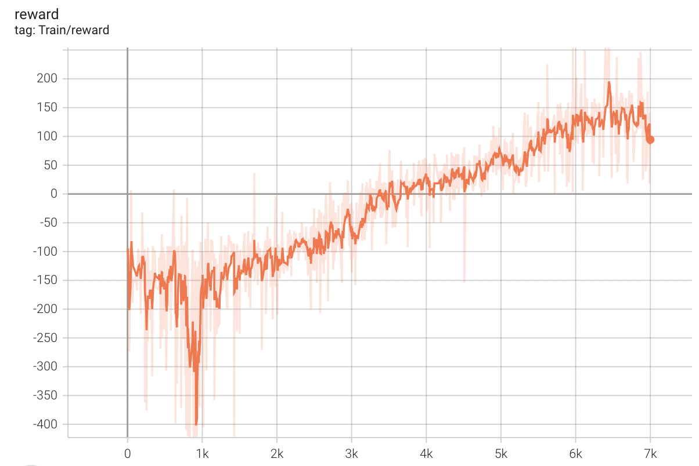

# REINFORCE algorithm

This repository implements vanilla REINFORCE algorithm, REINFORCE with baseline and REINFORCE with GAE using PyTorch.
Only discrete environment is supported.

## Installation

```
pip install -r requirements.txt
```

## Training

Use the default hyperparameters to train the model by running:
```
python reinforce.py --env [environment name]
```

### Results
#### Vanilla REINFORCE: CartPole-v1 


### REINFORCE with baseline: LunarLander-v2 


### REINFORCE woth GAE: LunarLander-v2


